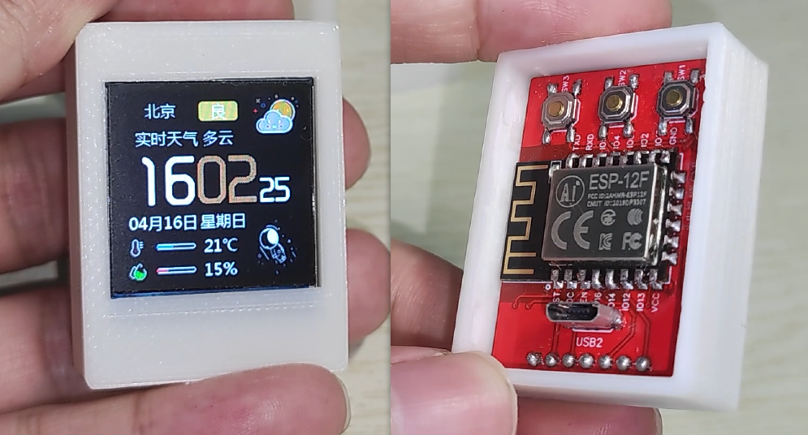
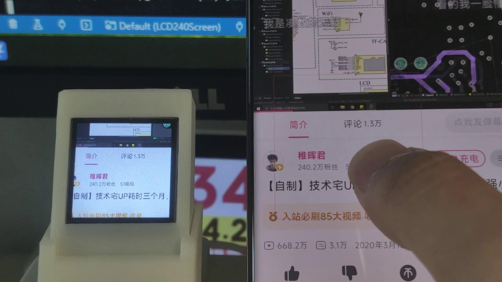
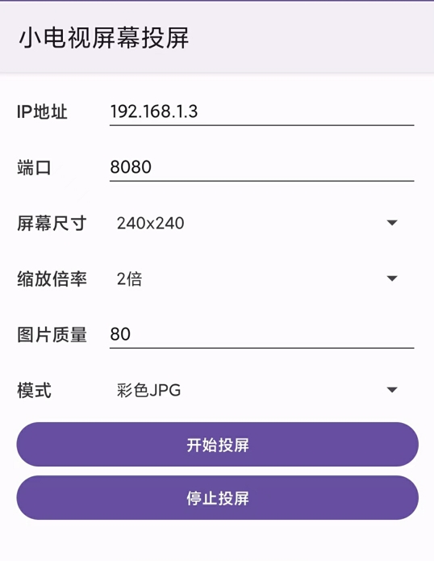

# Hello240Screen
自制的小电视，主控esp8266，240x240彩色屏幕，3个按键。有投屏，天气，电脑监视器功能

# 成品效果演示
演示视频：https://www.bilibili.com/video/BV1bc411H7Vx/

电路：

手机投屏，小电视作为TCP服务端，接收手机通过tcp发送的图片数据

# 原理图
原理图和PCB：https://oshwhub.com/chenyuebo/lcd-xiao-dian-shi-240x240

# 文件夹目录
1. Hardware: 原理图和PCB
2. Firmware：小电视固件源码
3. Software：
    - Hello240-Android：安卓投屏程序源码
4. 3D Model: 结构外壳，用于3D打印

# 备注
本人为纯软件程序员，本项目纯属个人爱好自学制作，主要目的是学习，部分功能待优化，也可能会有错误，希望大家理解和指正。

# TODO
- 安卓投屏程序，小电视接收成功后就发送下一帧数据，而不是定时发送，可能会提高一点点帧率